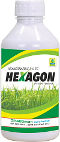

Farming is the primary source of livelihood for about 58 per cent of India’s population and yet it is the most neglected area in terms of advancement. We are still relying on old conventional methods of farming and have been struggling to raise agricultural productivity, to maintain high yield, and to prevent Crop failures due to unexpected weather conditions, crop diseases and lack of maintenance. All of these factors threaten quality and volume of farmers’ yields.
In majority of cases either disease , infections are ignored or done at later stages as a damage control . If proper proactive measures can taken up the Yield can be improved to 10 times.
Our aim is to solve most of the farming problems, provide higher productivity and to make every farmer Atmanirbhar (self dependent) with  “krishak”.

Core of our technology will consist of satellite imagery AI engine for land and crop assessment, monitoring and providing well informed alerts to stop Crop losses. With the land assessment and monitoring system we will be able to predict the suitable crops to be grown on the assessed land, detect any crop disease at an early stage and provide easy resolutions. 
Our Easy to use app for Farmers will take the weather and climate information of the region into account for making the yield predictions and suggest best timings for each step in the crop cycle. The app will provide all kinds of suggestions for keeping the yield high and crops disease free. 
Recommendation system for Farmers will be AI system, which will collect expertise and knowledge of Agricultural scientist. The App will automatically detect (with satellite image and historical data) any infection or disease early and recommends cost effective pesticides according to land size, crop stage with proper instructions  
The interface of this app will be simple and easy to use for all farmers.
This app will transform the farming industry, making the life of farmers easy and crops healthy.

How this works
### 1. Analyse Satelite images of an Area for last week

### 2. Collect Weather and climate conditions

Low night temperature (22 to 28°C)

High relative humidity (> 95%)

New deposit

Extended leaf wetness period (>10 hrs)

Cloudy and drizzling weather

Soil fertility (High N)

Degree of host susceptibility

Straw of the previously infected crop heaped nearby 

### 3. Displaying a crop with obious damges in paddy(Automatically by krishak app)
       It will display what will happen if no treament done on crop. 
	   It will also display how much Rupees farmer will lost month by month .
	   First month Loss in Rupees :- 56000
	   Second month Loss in Rupees :- 158000
	   Third month Loss in Rupees :- 246000

       

### 3. confirmation of disease by Farmer using image selector

### 3. explaination of disease

### 4. Treatment for disease

	Preventive measures:

	Use of resistant varieties like Gauthami, IR-36, IR-64, Parijatha, Rasi, Sasyashree, Salivahana, Simhapuri, Srinivas, Tikkana
	Burn previously blast affected straw and stubbles
	Use of disease free seeds
	Use of balanced rates of nutrition based on soil test- split applications of nitrogen  (Excessive N use can promote excessive luxuriant crop growth which increases the relative humidity and leaf wetness of the crop canopy. This can lead to increased infection).

	Biological control:

	Seed treatment with Pseudomonas fluorescence (10g / 1 of water) for 30 min.
	Seedling root dip treatment with Pseudomonas fluorescence (4g / 1 of water) for 20 min (   Videos-1,2,3,4, and 5 )
	Foliar spray of Pseudomonas fluorescence (4g / 1 of water) at 20-25 days after transplanting.
